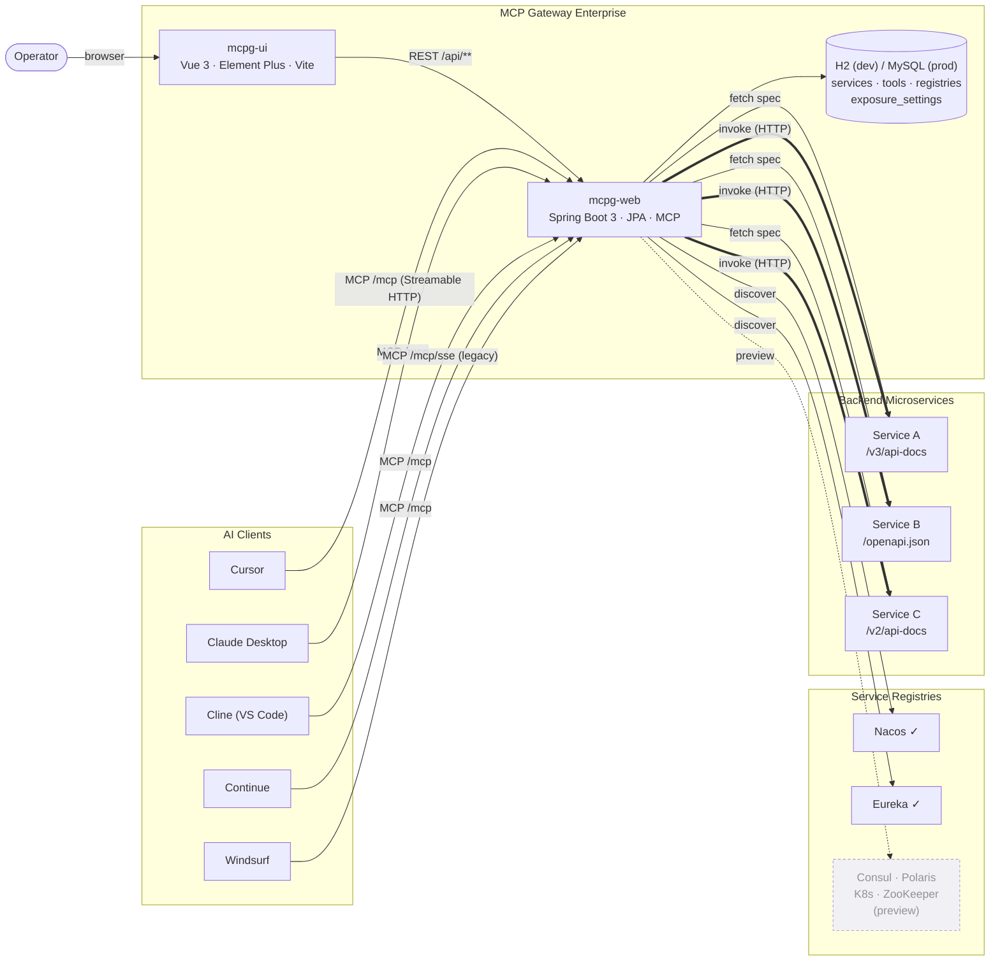
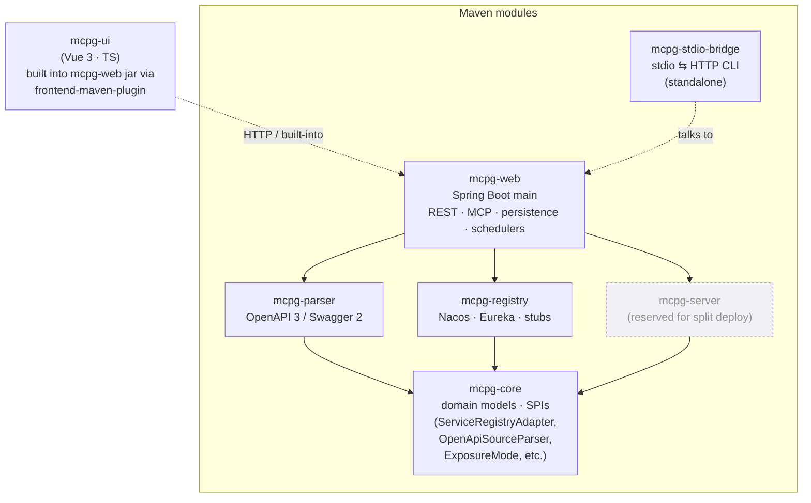
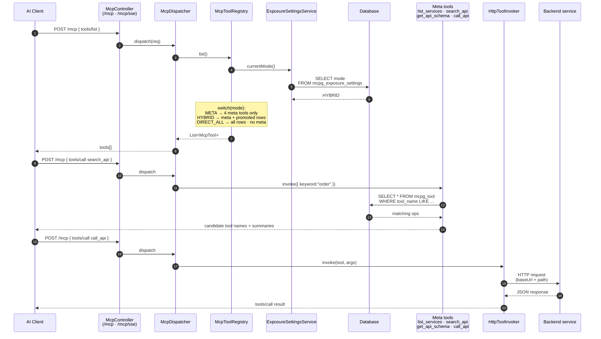
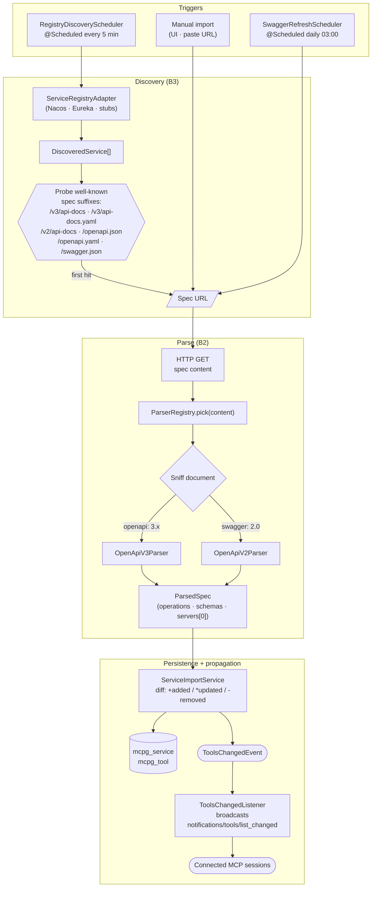

# Architecture / 架构图

> Diagrams render natively in GitHub and the Cursor preview. Labels are kept
> English so they stay legible in dark mode, with short Chinese notes below
> each diagram.

---

## 1. System overview · 系统总览

How the gateway sits between AI clients (Cursor / Claude / Cline / …),
operator-facing UI, and the existing service estate (registries +
microservices) of an enterprise.

中文说明：
- 运营走浏览器进 **mcpg-ui**，所有写操作都打到 `/api/**`。
- AI 客户端走 MCP 协议接 `/mcp`（现行 Streamable HTTP）或 `/mcp/sse`（旧版，留给老 Cursor 等）。
- 网关一边从 **注册中心**（Nacos / Eureka 已实现，其他先放空壳）发现服务，
  另一边拉 **微服务自身的 OpenAPI/Swagger 文档** 把接口转成 MCP 工具。
- LLM 通过 MCP 元工具调到的接口最终由网关用普通 HTTP 调出去——`Web ==> S_*` 那条加粗箭头。

---

## 2. Module structure · 模块依赖

Maven multi-module + a Vue front-end packaged into the Spring Boot jar by
`frontend-maven-plugin`.

中文说明：
- **mcpg-core** 是分层的根 —— 所有 SPI（注册中心适配、Swagger 解析、工具调用）
  都在这里定义，**parser / registry 都只依赖 core**，未来想替换某一层不用碰其他模块。
- **mcpg-web** 是真正的运行实体（Spring Boot main + 持久化 + 调度 + REST + MCP），
  也是把 Vue 前端 dist 打进 jar 的那个模块。
- **mcpg-server** 目前是预留 —— 后续如果要把"网关运行时"和"管理端"拆开部署，
  就把 MCP 端点搬到这里、`mcpg-web` 只留运营管理 REST。
- **mcpg-stdio-bridge** 是单独打包的轻量 CLI，让只会讲 stdio 的客户端也能接上网关。

---

## 3. MCP request flow & exposure modes · MCP 调用 + 暴露策略

What happens when an LLM calls `tools/list` and then `tools/call`, plus how
the active `ExposureMode` (META / HYBRID / DIRECT_ALL) reshapes the advertised
tool set.

中文说明：
- `tools/list` 每次都现算 —— `McpToolRegistry.list()` 第一件事就是问
  `ExposureSettingsService.currentMode()`，所以运营在 UI 切换模式后客户端立刻看到变化。
- **三种暴露策略**：
  | 模式 | 暴露的工具 | 取舍 |
  |---|---|---|
  | `META` | 仅 4 个元工具 | LLM 上下文最省，但每次调用需要 2 跳（搜 → 调） |
  | `HYBRID`（默认） | 4 元工具 + 已 Promote 的接口 | 兼顾发现性 & 上下文预算 |
  | `DIRECT_ALL` | 所有非废弃接口直接暴露，无元工具 | 工具数膨胀，适合 demo / 单服务 |
- LLM 真正想"调"某个接口时走 `call_api`（在 META 下）或直接调以 `toolName` 命名的工具（在 HYBRID/DIRECT_ALL 下），最终都由 `HttpToolInvoker` 把请求拼出来打到后端。
- 任何模式切换 / 服务导入 / Promote 都会发 `ToolsChangedEvent`，
  `ToolsChangedListener` 把 `notifications/tools/list_changed` 广播给所有已连接的 MCP session，客户端无需重连。

---

## 4. Service discovery & import pipeline · 发现与导入流水线

Three entry points (manual / daily refresh / registry polling) all funnel
into the same content-sniffing parser dispatch and persistence flow.

中文说明：
- 三种入口最后汇聚到同一段"拉文档 → 解析 → 入库 → 通知"的代码，无重复逻辑。
- 解析器派发是 **内容嗅探**：`ParserRegistry` 把文档丢给所有注册的 `OpenApiSourceParser`，
  谁的 `supports()` 返回 true 谁接活。新增方言（如 AsyncAPI / gRPC 反射）只要再加个 `@Component` 即可，不用动调用方。
- 注册中心适配的位置同理 —— `ServiceRegistryAdapter` 是 SPI，Nacos / Eureka 是
  实例，未来 Consul / Polaris / K8s 实现填上就行。

---

## 5. Key design decisions · 关键设计取舍

| 主题 | 决策 | 原因 |
|---|---|---|
| 元工具 vs 直接暴露 | 默认 **HYBRID**（4 元工具 + Promote） | 多服务聚合时单纯 DIRECT_ALL 会爆 LLM 上下文；纯 META 又损失发现性 |
| MCP 传输 | **同时支持** Streamable HTTP（`/mcp`） + HTTP/SSE（`/mcp/sse`） | 现代 Cursor / Claude / Cline 用前者，老版本只识别后者 |
| 注册中心适配 | SPI（`ServiceRegistryAdapter`）+ 真实/空壳分离 | 真实落地 Nacos + Eureka；其他用空壳类占位，UI 早就能展示完整路线图 |
| 解析器选择 | 运行时**内容嗅探**而非按 URL 后缀 | URL 路径千差万别（`/v3/api-docs` / `/openapi.json` / `/swagger.json`…），按内容判断更稳 |
| 事件传播 | Spring `ApplicationEventPublisher` 发 `ToolsChangedEvent` | 解耦 import / promote / 模式切换与 MCP 通知逻辑；新加触发点无需动 MCP 层 |
| 持久化 | **H2 (dev) / MySQL (prod)** 同一套 JPA | 单机就能跑 demo；生产改 `application.yml` 切 MySQL，无需改代码 |
| 前端集成 | `frontend-maven-plugin` 把 Vue dist 打进 Spring Boot jar | 单 jar 部署，运维只需要 `java -jar` |
| stdio 兼容 | 独立 `mcpg-stdio-bridge` CLI 模块 | 不污染 Web 模块；老客户端只能讲 stdio 时手动起 bridge |
