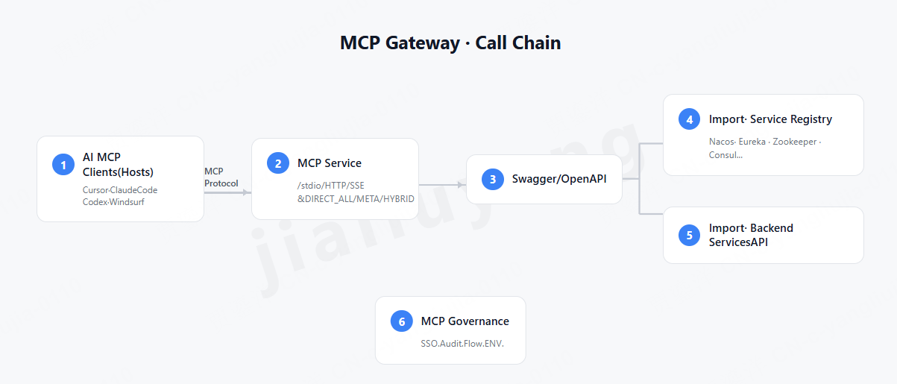

# MCP Gateway Enterprise

<p align="center">
  <a href="https://github.com/jialiuyang/MCP-Api-Gateway/actions/workflows/build.yml">
    
  </a>
  
</p>

<p align="center">
  <a href="https://github.com/jialiuyang/MCP-Api-Gateway/issues">
    
  </a>
  <a href="https://github.com/jialiuyang/MCP-Api-Gateway/pulls">
    
  </a>
  
</p>

<p align="center">
  
  
  
  
  
</p>



> Enterprise-grade [Model Context Protocol](https://modelcontextprotocol.io/) gateway that auto-discovers internal microservices and exposes them as MCP tools consumable by AI clients such as Cursor, Claude Code, Claude Desktop, Codex and Windsurf.

English | [简体中文](./README.md)

---

## What is it

**MCP Gateway Enterprise (MCPG)** is a configuration-driven gateway that turns a company's existing microservice fleet into MCP tools that an AI client can call directly. No business code changes required.

Platform operators only need to:
1. Configure a service registry (Nacos / Eureka / etc.)
2. Let MCPG auto-discover services, fetch their Swagger / OpenAPI specs, and synthesize MCP tools
3. Drop the MCP endpoint URL into Cursor (or any compliant client) and start using it

## Key features

| Capability | Description |
|-----------|-------------|
| 🔌 **Multi-registry** | Nacos / Eureka out of the box; Consul / Polaris / K8s / Zookeeper stubs ready to grow |
| 📚 **Multiple OpenAPI dialects** | Swagger 2.0, OpenAPI 3.0 / 3.1 (covers Springdoc, Springfox, FastAPI, …) |
| 🤖 **Three exposure modes** | `META` (meta tools), `DIRECT_ALL` (all-in), `HYBRID` (meta + promoted operations) |
| 🛠️ **Meta tools** | `list_services` / `search_api` / `get_api_schema` / `call_api` — defeats tool-count explosion |
| ⏰ **Daily refresh** | Cron-driven Swagger re-fetch with on-demand manual refresh |
| 🔒 **Governance hooks** | SSO, audit, environment isolation, write-op tiers, rate limit — interfaces reserved, UI live |
| 🚀 **Single jar / single image** | `mvn package` bundles the Vue console into the Spring Boot jar; `docker compose up` and you are done |


## 🐳 Docker one-click

### Option 1: Pull the prebuilt image (true one-liner)

Any machine with Docker installed:

```bash
docker run -d --name mcpg -p 8088:8088 ghcr.io/jialiuyang/mcp-api-gateway:latest
```

Boots in <10s. Open <http://localhost:8088/> in your browser. **No git clone / JDK / Maven / Node required.**

> Want to persist the H2 DB and logs? Add `-v <host-path>:/app/data`.
> The image is rebuilt by GitHub Actions on every push to `main`. Available tags: `latest` / `sha-<7>` / `main`.

### Option 2: Build from source (for development)

```bash
git clone https://github.com/jialiuyang/MCP-Api-Gateway.git
cd MCP-Api-Gateway
docker compose -f docker-compose.demo.yml up --build -d
```

First build: ~3–5 min (Maven deps + Node 20 + Vue bundle). Subsequent starts ≤10s.
H2 files and logs land in `./data/` and survive restarts.
Stop: `docker compose -f docker-compose.demo.yml down`.

### Endpoints once running

| Endpoint | URL |
|------|-----|
| Console UI | <http://localhost:8088/> |
| API docs (Swagger UI) | <http://localhost:8088/swagger-ui.html> |
| Health | <http://localhost:8088/actuator/health> |
| MCP endpoint (recommended) | `http://localhost:8088/mcp` |
| MCP endpoint (legacy SSE clients) | `http://localhost:8088/mcp/sse` |

> Need a slimmer production image? A single-stage `Dockerfile` is also provided; it expects you to have already run `mvn package` on the host, which fits nicely into your own CI pipeline.

## Quick start (from source)

### Prerequisites

- JDK 17+
- Maven 3.9+
- Internet access to Maven Central (Node 20 will be downloaded automatically)
- *Optional*: a reachable Nacos / Eureka instance for service discovery

### Build and run

```bash
git clone https://github.com/jialiuyang/MCP-Api-Gateway.git
cd MCP-Api-Gateway
mvn clean package           # Builds both backend and frontend
java -jar mcpg-web/target/mcpg-web.jar
```

> Default port is **8088** (avoids Nacos defaults 8080/8848). Override with `MCPG_PORT=xxxx`.

> Skip the frontend rebuild for backend-only iteration: `mvn package -Dskip.frontend=true`

## Connect Cursor

In `~/.cursor/mcp.json` (or the workspace-level `.cursor/mcp.json`):

```json
{
  "mcpServers": {
    "mcpg-local": {
      "url": "http://localhost:8088/mcp"
    }
  }
}
```

A 5-minute walkthrough (Petstore-based demo, prompts and screenshots) is in
[`docs/demo-cursor.md`](./docs/demo-cursor.md).

## Tech stack

- **Backend**: Java 17 + Spring Boot 3.5 + Spring Data JPA + H2 (dev) / MySQL (prod)
- **MCP**: [`io.modelcontextprotocol.sdk:mcp`](https://github.com/modelcontextprotocol/java-sdk)
- **OpenAPI**: [`io.swagger.parser.v3:swagger-parser`](https://github.com/swagger-api/swagger-parser)
- **Registries**: `nacos-client`, `eureka-client`
- **Frontend**: Vue 3 + Vite + TypeScript + Element Plus + Pinia
- **Build**: Maven multi-module + frontend-maven-plugin (one-click build)

See [ARCHITECTURE.md](./ARCHITECTURE.md) for the full architecture (4 Mermaid diagrams);
visual standalone versions: [docs/architecture.html](./docs/architecture.html) (dark hero) and
[docs/flow.html](./docs/flow.html) (user-side runtime call chain).

## Design decisions

See [docs/design-decisions.md](./docs/design-decisions.md). Topics include:

- Why a meta-tool model rather than direct exposure
- Why the Spring Boot app does not speak stdio directly
- How "read-only replica" data sources fit into the governance model
- Trade-offs of the three exposure strategies

## Contributing

Issues and PRs are very welcome — please read [CONTRIBUTING.md](./CONTRIBUTING.md) first.
 
If this project saves you time, please consider giving it a ⭐ — it helps others discover the project.
Got questions or ideas? Open an [Issue](https://github.com/jialiuyang/MCP-Api-Gateway/issues/new) or join the [Discussions](https://github.com/jialiuyang/MCP-Api-Gateway/discussions).

## License

[Apache License 2.0](./LICENSE)
